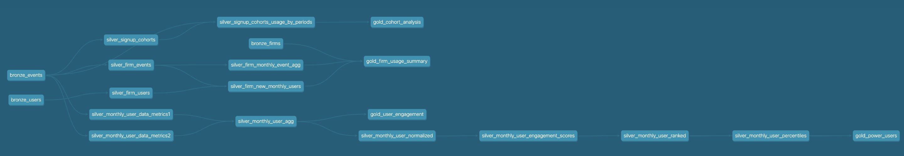

Hello!

Here's my submission for this assessment.

Questions to Analytics Questions: [My Answers](extras/Analytics_Questions.ipynb)

data modeling (dbt)

Here's a view of my data model. I decided to go with a medallion architecture (bronze/silver/gold) in order fit the use case better than a dimensional data model.
data models can be found [here:](models/):

1. Assumptions:
  i. I assumed that the datasets that were provided were going to be my raw datasets so I have them as my bronze datasets in which I don't make much changes to them.

Final table outputs can be found here that are explained below. [gold_output tables](final_output_tables/)

2. Interpretation:

i. gold_user_engagement: For the user engagement table I wanted to use metrics that I believe were a good represenation of the users engagement and that I could use down the line to create a        power user ranking system.

   
          Fields Used:
          sessions: number of sessions user had (every event is a session)
          num_event_types: number of unique types 
          total_docs: total number of docs user created
          types: group concat for the types field because I wanted to get a field to show if the user may have used all events. 
          avg_docs_per_session: average number of docs user created per session
          last_day: user last day online each month
          avg_feedback_score: average feedback user provided amongst all sessions 
          pct_good_feedback: count of scores that were more than 4 / total scores given
          active_days: Made a change to more than 1 doc in the same day then they can be considered active. Distribution looked to be close to 1.
          avg_docs_per_active_day: average number of docs an active member used on their active days
   ii. gold_firm_usage_summary:  I decided to break down by month because if we look at overall then some firms will always tend to look like they have a lot of activity because of the number of         users they have on the platform.  

          Fields Used:
          FIRM_SIZE: NA
          ARR_IN_THOUSANDS: NA
          active_users: users with an event in that mont
          events: total number of events 
          total_docs: total number of docs used
          avg_docs_per_event: average number of docs per event 
          avg_feedback_score: average feedback user provided amongst all sessions
          I wanted to break down the event types into their own columns because if we wanted to give a threshold on specific events then we can easily do so with this view
          workflow: total docs in that are workflow related
          vault: total docs in that are vault related
          assistant: total docs in that are assistant related
          I kept arr in thousands and so that will mean you have to multiple the other arr fields by 1000 to get the actual number.
          avg_docs_per_user: average number of docs each user used per event in the month
          arr_per_doc: how much a doc generated 
          arr_per_active_user: how much an active user generated
   iii. gold_cohort_analysis: I decided to go with cohort because it helps with understanding retention overtime, enagement overtime and great for a/b experimentation and campaign impact.

          Fields Used:
          activity_month: current activity of the user within the month
          active_users: number of active users which I elected to just be number of distinct users
          avg_events_per_user: average number of events use has been in the month
          avg_docs_per_user: average number of docs user used per event in the month (may be skewed if they used only one)

3.[Materializations](dbt_project.yml): Not every table was materialized to a table output. I used three materializations (table, views, ephemeral). For ephemeral tables, I mainly did this because they were mainly in my silver (transformation layer) and a lot of the scripts I was using were calculations for a view or table. It also helped me with storage. I decided to have the bronze layer in which all of the raw data is at as views because we aren't really using these tables. For my gold tables, those are all materialized as tables since we want our end users to be able to query from them and use them in dashboards frequently. 
